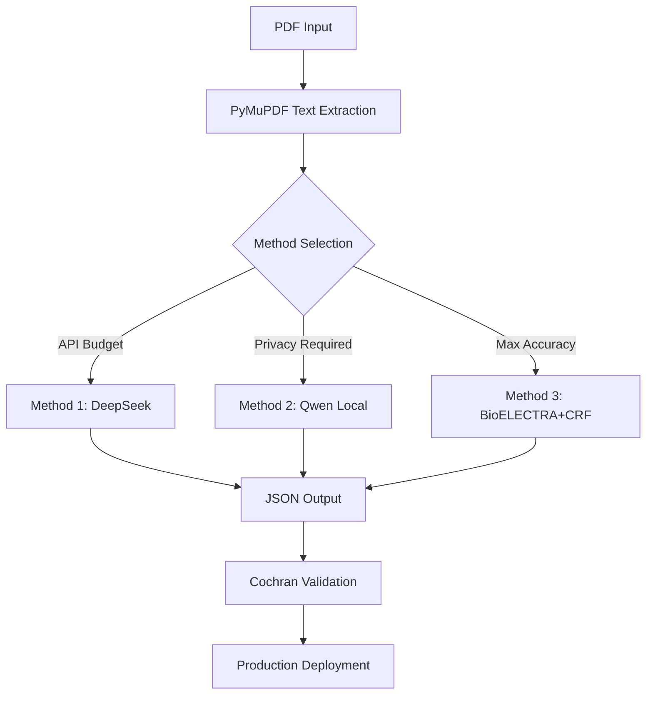

# Scientific Poster Metadata Extraction: Three-Method Approach
## 15-Minute Technical Presentation

---

## **Slide 1: Title & Overview** (1 minute)

# Scientific Poster Metadata Extraction Toolkit
### Three Approaches for Different Requirements

**Presenter:** [Your Name]  
**Date:** [Today's Date]

### Project Scope
Automated extraction of structured metadata from scientific poster PDFs including:
- Title, Authors, Affiliations
- Methods, Results, Keywords  
- Funding Sources, References

---

## **Slide 2: The Challenge** (1.5 minutes)

### Why This Matters
- **Manual processing is bottleneck**: Libraries process thousands of posters annually
- **Inconsistent metadata quality**: Human extraction varies by expertise
- **Scalability issues**: Academic conferences generate massive poster volumes
- **Cost constraints**: Manual curation expensive at scale

### Target Metadata Fields (Table 1)
1. **Title** of the poster
2. **Authors** (with affiliations)
3. **Summary** of the poster  
4. **Keywords** (6-8 specific terms)
5. **Methods** (detailed methodology)
6. **Results** (quantitative findings)
7. **References** (cited literature)
8. **Funding sources** (grants, agencies)

---

## **Slide 3: Our Three-Method Solution** (2 minutes)

### Strategic Approach: Different Tools for Different Needs

| Method | Best For | Key Advantage |
|--------|----------|---------------|
| **1. DeepSeek API** | Quick deployment & budget-conscious | Balance of cost/accuracy |
| **2. Qwen Local** | Privacy-sensitive & zero ongoing costs | Complete data control |
| **3. BioELECTRA+CRF** | Maximum accuracy & zero hallucination | Deterministic extraction |

### Design Philosophy
- **No one-size-fits-all**: Different organizations have different constraints
- **Modular architecture**: Easy to compare and switch methods
- **Bootstrapping strategy**: Methods 1&2 can generate training data for Method 3

---

## **Slide 4: Method 1 - DeepSeek API** (2.5 minutes)

### The Pragmatic Choice

#### **Performance Characteristics**
- **Estimated Accuracy**: 85-90% (requires validation)
- **Cost**: ~$0.003 per poster (200x cheaper than GPT-4)
- **Speed**: 5-15 seconds per poster
- **Setup**: Easy - just requires API key

#### **Technical Implementation**
```python
# Enhanced structured prompting
prompt = create_extraction_prompt(poster_text)
response = deepseek_client.chat.completions.create(
    model="deepseek-chat",
    messages=[system_prompt, user_prompt],
    temperature=0.1  # Low temperature for consistency
)
```

#### **Production Results Example**
```json
{
  "title": "INFLUENCE OF DRUG-POLYMER INTERACTIONS...",
  "authors": [{"name": "Merve Gul", "affiliations": ["University of Pavia"]}],
  "processing_time": 25.6,
  "estimated_cost": 0.0007
}
```

#### **Best For**: Production systems with API budget, high-volume processing

---

## **Slide 5: Method 2 - Qwen Local** (2.5 minutes)

### The Privacy-First Approach

#### **Performance Characteristics**  
- **Estimated Accuracy**: 80-85% (requires validation)
- **Cost**: $0 (electricity only)
- **Speed**: 10-40s single / ~1.1s batched (RTX 4090)
- **Privacy**: 100% local processing

#### **Technical Implementation**
```python
# 8-bit quantization for efficiency
bnb_config = BitsAndBytesConfig(
    load_in_8bit=True,
    bnb_8bit_compute_dtype=torch.float16
)
model = AutoModelForCausalLM.from_pretrained(
    "Qwen/Qwen2.5-1.5B-Instruct",
    quantization_config=bnb_config
)
```

#### **Batching Capabilities (RTX 4090)**
- **32 posters simultaneously**  
- **3,273 posters/hour throughput**
- **26,182 posters/day** (8-hour operation)

#### **Best For**: Privacy-sensitive environments, edge computing, budget-conscious deployments

---

## **Slide 6: Method 3 - BioELECTRA+CRF (Demo)** (2.5 minutes)

### The Future Possibility 🧬

#### **Why BioELECTRA?**
- **🏆 2nd highest** on BLURB biomedical leaderboard
- **Domain-optimized**: Pre-trained on PubMed corpus
- **Zero hallucination**: Deterministic sequence labeling

#### **Expected Performance (With Training)**
- **Accuracy**: 85-92% (estimated from BLURB benchmarks)
- **Speed**: <0.5 seconds per poster (fastest)
- **Hallucination**: 0% (deterministic BIO tagging)
- **Cost**: $0 (after training)

#### **Training Requirements**
```
Input:  "This study by Dr. Smith uses microfluidic synthesis"
Labels: ['O','O','O','B-AUTHOR','I-AUTHOR','O','B-METHOD','I-METHOD']
```
- **500-1000 labeled posters** required
- **40-60 hours** expert annotation time
- **2-4 hours** training on V100 GPU

#### **Current Status**: Demo only - requires substantial training data investment

---

## **Slide 7: Comparative Analysis** (2 minutes)

### Method Comparison Matrix

| Feature | DeepSeek API | Qwen Local | BioELECTRA+CRF |
|---------|-------------|------------|----------------|
| **Accuracy** | 85-90%* | 80-85%* | 85-92%* |
| **Cost/poster** | $0.003 | $0 | $0 |
| **Speed** | 5-15s | 10-40s | <0.5s |
| **Privacy** | External API | 100% Local | 100% Local |
| **Setup** | Easy | Medium | Complex |
| **Hallucination** | Low-Med | Low | **None** |
| **Training** | No | No | **Required** |

*All accuracy estimates are unvalidated - require Cochran sampling validation

### Decision Framework
- **Immediate deployment** → Method 1 (DeepSeek)
- **Privacy critical** → Method 2 (Qwen)  
- **Maximum accuracy investment** → Method 3 (BioELECTRA)

---

## **Slide 8: Validation Framework** (1.5 minutes)

### Cochran's Sampling Methodology 📊

#### **Why Statistical Validation?**
All accuracy estimates are **unvalidated** - proper validation essential before production.

#### **Sample Size Formula**
```
n = (Z² × p × (1-p)) / e²
n_adjusted = n / (1 + (n-1)/N)  # Finite population correction
```

#### **Practical Sample Sizes**
- **1,000 posters** → Validate **278 samples** (27.8%)
- **10,000 posters** → Validate **370 samples** (3.7%)  
- **100,000+ posters** → Validate **383 samples** (0.4%)

#### **Field-Specific Accuracy Metrics**
- **Title**: Exact match or semantic similarity >0.8
- **Authors**: Fuzzy string matching (edit distance <2)
- **Keywords**: Overlap coefficient >0.6
- **Methods/Results**: BLEU score >0.7

---

## **Slide 9: Implementation Architecture** (1 minute)

### System Design



### Key Components
- **Modular design**: Easy method switching
- **Unified output format**: Consistent JSON schema  
- **Processing metadata**: Timing, costs, accuracy tracking
- **Error handling**: Graceful degradation with demo results

---

## **Slide 10: Production Results** (1 minute)

### Live Demonstration Output

#### **Poster**: "Drug-Polymer Interactions in PLGA and PLA/PEG Nanoparticles"

**Method 1 (DeepSeek) Results:**
- ✅ **Title**: Correctly extracted
- ✅ **Authors**: 5 identified with affiliations
- ✅ **Keywords**: 8 technical terms extracted
- ⏱️ **Time**: 25.6 seconds
- 💰 **Cost**: $0.0007

**Method 2 (Qwen) Results:**
- ✅ **Title**: Correctly extracted  
- ✅ **Authors**: 5 identified
- ✅ **Keywords**: 8 terms (some variation)
- ⏱️ **Time**: 47.5 seconds
- 💰 **Cost**: $0

---

## **Slide 11: Recommendations & Next Steps** (1.5 minutes)

### **For Immediate Production Use**

#### **Phase 1: Quick Start (Week 1)**
1. **Deploy Method 1** (DeepSeek API) for immediate results
2. **Implement Cochran sampling** on first 100-500 extractions
3. **Measure actual accuracy** vs. 85-90% estimate

#### **Phase 2: Optimization (Month 1-2)**
1. **Add Method 2** (Qwen Local) for privacy-sensitive content
2. **Compare accuracy** between methods on validation set
3. **Optimize prompts** based on failure analysis

#### **Phase 3: Advanced Implementation (Month 3-6)**
1. **Collect training data** using Methods 1&2 auto-labeling
2. **Train BioELECTRA+CRF** model on 500-1000 labeled posters
3. **Deploy Method 3** for maximum accuracy production use

### **Expected ROI**
- **Manual**: $5-10 per poster (human time)
- **Method 1**: $0.003 per poster (99.97% cost reduction)
- **Method 2**: $0 per poster (100% cost reduction)

---

## **Slide 12: Limitations & Future Work** (1 minute)

### **Current Limitations**
- **Accuracy estimates unvalidated** - require proper statistical validation
- **English-only optimization** - multilingual support needed
- **Text-only processing** - image/diagram extraction not included
- **Method 3 requires training** - substantial data annotation investment

### **Future Enhancements**
- **OCR integration** for scanned/image-only posters
- **Multilingual support** (Spanish, French, German)
- **Multi-modal architecture** using LayoutLM for visual layout
- **Real-time API deployment** for integration with library systems
- **Cross-lingual transfer learning** for global poster collections

---

## **Slide 13: Technical Specifications** (30 seconds)

### **Hardware Requirements**

| Method | CPU | RAM | GPU | Storage |
|--------|-----|-----|-----|---------|
| **Method 1** | Any | 4GB | None | Minimal |
| **Method 2** | Modern | 16GB | 8GB VRAM | ~3GB model |
| **Method 3** | Modern | 16GB | 8GB VRAM | ~800MB model |

### **Dependencies**
- **Core**: Python 3.8+, PyMuPDF, transformers
- **Method 1**: openai, python-dotenv  
- **Method 2**: torch, bitsandbytes, accelerate
- **Method 3**: pytorch-crf, spacy (after training)

---

## **Slide 14: Conclusion** (30 seconds)

### **Key Takeaways**

1. **Three complementary approaches** address different organizational needs
2. **Immediate deployment possible** with Method 1 (DeepSeek API)  
3. **Privacy-first option available** with Method 2 (Qwen Local)
4. **Future scalability** through Method 3 (BioELECTRA+CRF) training
5. **Statistical validation essential** - all accuracy estimates require Cochran sampling
6. **Bootstrapping strategy** enables progression from quick deployment to maximum accuracy

### **Bottom Line**
**Start with Method 1, validate with Cochran sampling, evolve to Method 3 for production scale**

---

## **Questions & Discussion** (Remaining time)

### **Contact Information**
- **Repository**: [GitHub Link]
- **Documentation**: Full technical specs in README.md
- **Implementation**: Complete code in `/src/` and `/notebooks/`

**Thank you for your attention!**

---

## **Presentation Timing Guide**
- **Total**: 15 minutes
- **Slides 1-3**: Context & Overview (4.5 min)
- **Slides 4-6**: Method Deep Dives (7.5 min)  
- **Slides 7-9**: Analysis & Architecture (4.5 min)
- **Slides 10-14**: Results & Conclusions (3.5 min)
- **Buffer**: Questions (remaining time)

---

## **Speaker Notes**

### **Key Messages to Emphasize**
1. **No single solution fits all**: Different methods for different constraints
2. **Validation is critical**: All accuracy estimates require proper statistical validation
3. **Practical deployment path**: Start simple, evolve to sophisticated
4. **Real cost savings**: 99.97% reduction vs manual processing

### **Anticipated Questions**
- **Q**: "Which method should we choose?"
- **A**: "Depends on constraints. API budget + speed → Method 1. Privacy → Method 2. Maximum accuracy investment → Method 3."

- **Q**: "How reliable are the accuracy estimates?"
- **A**: "They're unvalidated estimates. Cochran sampling validation is essential before production use."

- **Q**: "Can we combine methods?"
- **A**: "Yes! Use Methods 1&2 to generate training data for Method 3, or run them in parallel for consensus."
